# [G48] Report

## Table of Contents

1. [Team Members and Roles](#team-members-and-roles)
2. [Summary of Individual Contributions](#summary-of-individual-contributions)
3. [Conflict Resolution Protocol](#conflict-resolution-protocol)
4. [Application Description](#application-description)
5. [Application UML](#application-uml)
6. [Application Design and Decisions](#application-design-and-decisions)
7. [Summary of Known Errors and Bugs](#summary-of-known-errors-and-bugs)
8. [Testing Summary](#testing-summary)
9. [Implemented Features](#implemented-features)
10. [Team Meetings](#team-meetings)

## Team Members and Roles

| UID        |           Name           |                                                           Role |
|:-----------|:------------------------:|---------------------------------------------------------------:|
| [u7490701] |      [Ahmed Qaisar]      |                                     [Firebase, Data-Graphical] |
| [u7103031] |      [Lana Fraser]       |                                     [Login, Search and Report] |
| [u7432723] |     [Punit Deshwal]      | [Database Structures, UI Themes, Firebase, Initialising Users] |
| [u7108792] |      [Quoc Nguyen]       |                                 [Search, Tokenizer and Parser] |
| [u7533843] |      [Yanghe Dong]       |     [Tree Structure, Timer, Notifications, Creating User Data] |

## Summary of Individual Contributions

*u7490701, Ahmed, I contribute 20% of the code. Here are my contributions:*
* Firebase   https://console.firebase.google.com/u/0/project/comp2100-group-assignmen-e7d8d/overview

*Report Writing: N/A*

*Slide Preparation: N/A*
  

*u7103031, Lana, I contribute 20% of the code. Here are my contributions:*
* LoginActivity.java https://gitlab.cecs.anu.edu.au/u7103031/ga-23s1-comp2100-6442/-/blob/84340ce1bac212c6a7efc9e883084394362b2d3d/app/src/main/java/com/studybuddy/bathtub/LoginActivity.java
  * onCreate(), Lines: 75-101
  * showLoginMessage(), whole method
* RegisterActivity.java https://gitlab.cecs.anu.edu.au/u7103031/ga-23s1-comp2100-6442/-/blob/84340ce1bac212c6a7efc9e883084394362b2d3d/app/src/main/java/com/studybuddy/bathtub/RegisterActivity.java
  * onCreate(), Lines: 41-45, 63-66, 72-75, 83-87
* SearchActivity.java https://gitlab.cecs.anu.edu.au/u7103031/ga-23s1-comp2100-6442/-/blob/84340ce1bac212c6a7efc9e883084394362b2d3d/app/src/main/java/com/studybuddy/bathtub/SearchActivity.java
  * search(), whole method
  * createCourseTree(), whole method
  * getCourses(), whole method
* Colleges.java https://gitlab.cecs.anu.edu.au/u7103031/ga-23s1-comp2100-6442/-/blob/84340ce1bac212c6a7efc9e883084394362b2d3d/app/src/main/java/com/studybuddy/search/Colleges.java
  * whole class
* SearchParser.java https://gitlab.cecs.anu.edu.au/u7103031/ga-23s1-comp2100-6442/-/blob/84340ce1bac212c6a7efc9e883084394362b2d3d/app/src/main/java/com/studybuddy/search/SearchParser.java
  * parseQuery(), Lines:23-30
* activity_login.xml https://gitlab.cecs.anu.edu.au/u7103031/ga-23s1-comp2100-6442/-/blob/84340ce1bac212c6a7efc9e883084394362b2d3d/app/src/main/res/layout/activity_login.xml
  * whole class
* activity_register.xml https://gitlab.cecs.anu.edu.au/u7103031/ga-23s1-comp2100-6442/-/blob/84340ce1bac212c6a7efc9e883084394362b2d3d/app/src/main/res/layout/activity_register.xml
  * whole class

*UI Design: Proposed and designed the UI for the Login and Register class*

*Report Writing: N/A*

*Slide Preparation: N/A*
  

*u7432723, Punit, I contribute 20% of the code. Here are my contributions:*
* AssessmentsActivity.java
* Login.java: authenticateUser()
* MainActivity.java:
* Register.java
* StudyActivity.java: onCreate()
* User.java
* UserTimeState.java
* activity_main.xml
* item_course.xml
* activity_assessments.xml

*UI Design: Proposed and designed the UI for the Main class. Created a new colour theme for the app.
Developed many of the conceptual ideas for the designs of each UI screen and how they interact together*

*Report Writing: N/A*

*Slide Preparation: N/A*
  

*u7108792, Quoc, I contribute 20% of the code. Here are my contributions:*
* Query.java
* SearchActivity.java
* SearchParser.java
* Token.java
* Tokenizer.java
* CourseAdapter.java
* activity_search.xml
* Toaster.java
* course_cell.xml

*UI Design: Proposed and designed the UI for the SearchActivity class.*
*Code Design: Proposed and implemented the tokenizer and parser for the search feature. Created grammar
for tokenizer and parser, in conjunction with Logic for searching*

*Report Writing: N/A*

*Slide Preparation: N/A*
  

*u7533843, Yanghe, I contribute 20% of the code. Here are my contributions:*
* Login.java: https://gitlab.cecs.anu.edu.au/u7103031/ga-23s1-comp2100-6442/-/blob/main/app/src/main/java/com/studybuddy/bathtub/LoginActivity.java
* onCreate(), Lines: 54-73, 103-114
* createNotificationChannel(), whole method
* uploadDataPeriodically(), Lines: 234-252
* addUserToLeaderboardFirebase(), whole method
* MainActivity.java: https://gitlab.cecs.anu.edu.au/u7103031/ga-23s1-comp2100-6442/-/blob/main/app/src/main/java/com/studybuddy/bathtub/MainActivity.java
* onCreate(), Lines: 54-60, 110
* sendNotification(), whole method
* checkAndUpdateLeaderboardFirebase(), whole method
* addUserToLeaderboardFirebase(), whole method
* SearchActivity.java: https://gitlab.cecs.anu.edu.au/u7103031/ga-23s1-comp2100-6442/-/blob/main/app/src/main/java/com/studybuddy/bathtub/SearchActivity.java
* getCollegeCourses(), Lines: 383-408
* getCollegeTreeMap(), whole method
* SetTimeActivity.java: https://gitlab.cecs.anu.edu.au/u7103031/ga-23s1-comp2100-6442/-/blob/main/app/src/main/java/com/studybuddy/bathtub/SetTimeActivity.java
* whole class
* TimerActivity.java: https://gitlab.cecs.anu.edu.au/u7103031/ga-23s1-comp2100-6442/-/blob/main/app/src/main/java/com/studybuddy/bathtub/TimerActivity.java
* onCreate(), Lines: 66-70
* clickPauseOrResume(), whole method
* clickStop(), Lines: 103-122, 143-148
* timeUp(), Lines: 157-174, 195-200
* getLeaderboard(), whole method
* User.java: https://gitlab.cecs.anu.edu.au/u7103031/ga-23s1-comp2100-6442/-/blob/main/app/src/main/java/com/studybuddy/bathtub/User.java
* basic fields and methods in the initial version of this class
* notification: https://gitlab.cecs.anu.edu.au/u7103031/ga-23s1-comp2100-6442/-/tree/main/app/src/main/java/com/studybuddy/notification
* all classes in this directory
* RBTree.java: https://gitlab.cecs.anu.edu.au/u7103031/ga-23s1-comp2100-6442/-/blob/main/app/src/main/java/com/studybuddy/search/RBTree.java
* whole class
* MyTimer.java: https://gitlab.cecs.anu.edu.au/u7103031/ga-23s1-comp2100-6442/-/blob/main/app/src/main/java/com/studybuddy/timer/MyTimer.java
* whole class
* State.java: https://gitlab.cecs.anu.edu.au/u7103031/ga-23s1-comp2100-6442/-/blob/main/app/src/main/java/com/studybuddy/timer/State.java
* whole class
* idleState.java: https://gitlab.cecs.anu.edu.au/u7103031/ga-23s1-comp2100-6442/-/blob/main/app/src/main/java/com/studybuddy/timer/idleState.java
* whole class
* studyState.java: https://gitlab.cecs.anu.edu.au/u7103031/ga-23s1-comp2100-6442/-/blob/main/app/src/main/java/com/studybuddy/timer/studyState.java
* whole class
* pauseState.java: https://gitlab.cecs.anu.edu.au/u7103031/ga-23s1-comp2100-6442/-/blob/main/app/src/main/java/com/studybuddy/timer/pauseState.java
* whole class
* RBTreeTest.java: https://gitlab.cecs.anu.edu.au/u7103031/ga-23s1-comp2100-6442/-/blob/main/app/src/test/java/com/studybuddy/RBTreeTest.java
* whole class
* LeaderboardActivity.java: https://gitlab.cecs.anu.edu.au/u7103031/ga-23s1-comp2100-6442/-/blob/main/app/src/main/java/com/studybuddy/bathtub/LeaderboardActivity.java
* onCreate(), Lines: 44-63
* under_courses_data.json: https://gitlab.cecs.anu.edu.au/u7103031/ga-23s1-comp2100-6442/-/blob/main/app/src/main/assets/under_courses_data.json
* post_courses_data.json: https://gitlab.cecs.anu.edu.au/u7103031/ga-23s1-comp2100-6442/-/blob/main/app/src/main/assets/post_courses_data.json
* activity_set_time.xml: https://gitlab.cecs.anu.edu.au/u7103031/ga-23s1-comp2100-6442/-/blob/main/app/src/main/res/layout/activity_set_time.xml
* activity_study.xml: https://gitlab.cecs.anu.edu.au/u7103031/ga-23s1-comp2100-6442/-/blob/main/app/src/main/res/layout/activity_study.xml
* ic_pause.xml: https://gitlab.cecs.anu.edu.au/u7103031/ga-23s1-comp2100-6442/-/blob/main/app/src/main/res/drawable/ic_pause.xml
* ic_resume.xml: https://gitlab.cecs.anu.edu.au/u7103031/ga-23s1-comp2100-6442/-/blob/main/app/src/main/res/drawable/ic_resume.xml
* ic_stop.xml: https://gitlab.cecs.anu.edu.au/u7103031/ga-23s1-comp2100-6442/-/blob/main/app/src/main/res/drawable/ic_stop.xml

*Code Design: Proposed and implemented a RB tree structure for storing course data. Proposed and implemented a singleton design pattern to create the timer. Proposed and implemented a state design pattern for the timer functionality. Proposed and implemented a factory design patter to send different kinds of notifications.*

*UI Design: Proposed and designed the UI of SetTimeActivity and TimerActivity.*

*Report Writing: N/A*
*Slide Preparation: N/A*

## Conflict Resolution Protocol

All disputes in contributions and team issues will follow the Conflict Resolution Plan.
  furthermore, all team members will be expected to follow the Code of Conduct. More info can
  be found here: https://www.anu.edu.au/students/program-administration/program-management/student-code-of-conduct

Conflict Resolution Plan:
1. Clarify the source of the problem. Have an open discussion to single out the issue
2. Identify barriers outside of the conflict which may impede it's resolution
3. Discuss ways to resolve the conflict by establishing a common goal
4. Explore how they goal can be reached and develop final agreement

Conflict Management Strategies:
1. Avoidance: don't try to avoid the conflict.
2. Communication: talk to your peers about the conflict so that the necessary protocols can be
   taken.
3. Accessibility: make the protocols easy to follow but effective in resolution.
4. Fairness: make sure that the protocols are fair to all parties involved.
5. Team Engagement: make sure that all team members are engaged in the resolution process.

Additional Info:
* If a member fails to meet the initial plan and/or deadlines, the team will have a group
  discussion and discuss with the member what exactly they are struggling with and what form of
  support they need.
* If deemed useful, another member will be assigned to work collaboratively with said member and
  help to address the main issues with the task. If needed, the tasks may be redistributed.
* If a member gets sick, their tasks will be distributed to each remaining team member evenly.
  Once the sick member able to work again, they will continue and finish the tasks that they were
  working on previously if the task aren't already finished, and be assigned new tasks if the
  amount of work they have completed falls significantly short of others negatively impacting
  both themselves and the group.
* If a member is going through any personal issues, the members of the group must be understanding
  and try to assist the group member with any tasks they need help with or reduce their workload.
  This will be discussed in a team meeting and a consensus must be met between all group members
  to ensure that the solution is fair.
* Any other issue not mentioned above will be resolved by a last resort numerical vote.

## Application Description

StudyBuddy is a productivity and educational app that allows its users to keep track of the time that
they have spent studying for each subject that they are enrolled in. There is a leaderboard in the app
 which displays the top 5 Users in the app, letting the User see how the are preforming comparatively and
  motivate them to study. This app includes a login interface, the ability to search for and enroll in courses,
   a timer functionality, and a graphics summary / leaderboard page.

**Application Use Cases**

*Targets Users: Students*

* Users can register an account and login to the app.
* Users can search for and enroll in courses. The app will provide a brief overview of the course,
its convener and its assessments.
* Once enrolled users can select one of their courses and set a timer for amount the time they would
like to study
* A user can view a summary of their total time studied.
* A user can view a leaderboard of the top 5 users in the app.

**Use Case Diagram**  
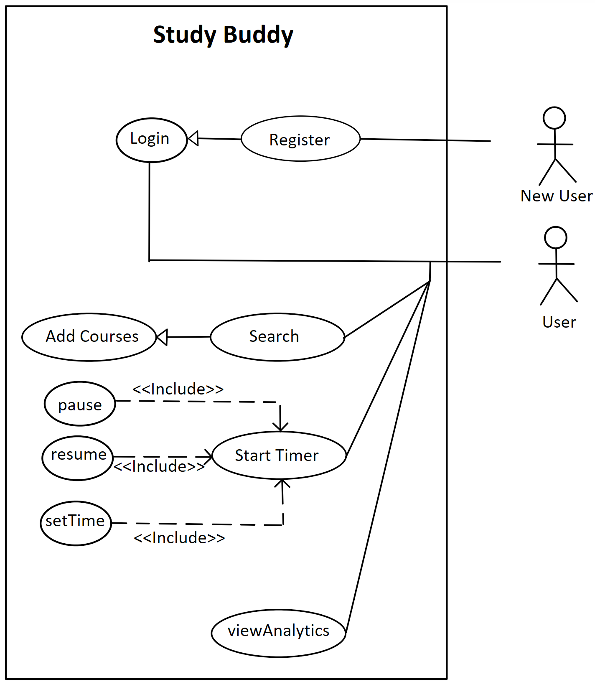  

See below for a visual breakdown of each key part of our app.
 
  **Login and Register**  
Once the app is launched, the user is presented with the login interface. If the user does not have
an account, they can click the register button to be taken to the register interface. The register
interface will require that the users UID is exactly 7 letters long, and that the password and confirm password fields are the same. the user will also have to select their
student type (undergrad or postgrad), as this will determine what classes they may choose. The login and user interface will both
display toasts is the user tries to login or register without filling all of the fields. Upon successful registration, the user
will be taken to the home page but will be required to login each subsequent use. At the login screen the user will be taken to
the home page if their details match those stored in the Firebase.
 
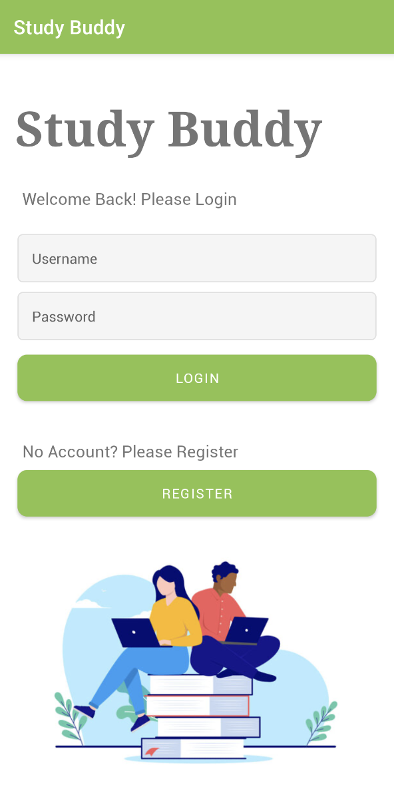
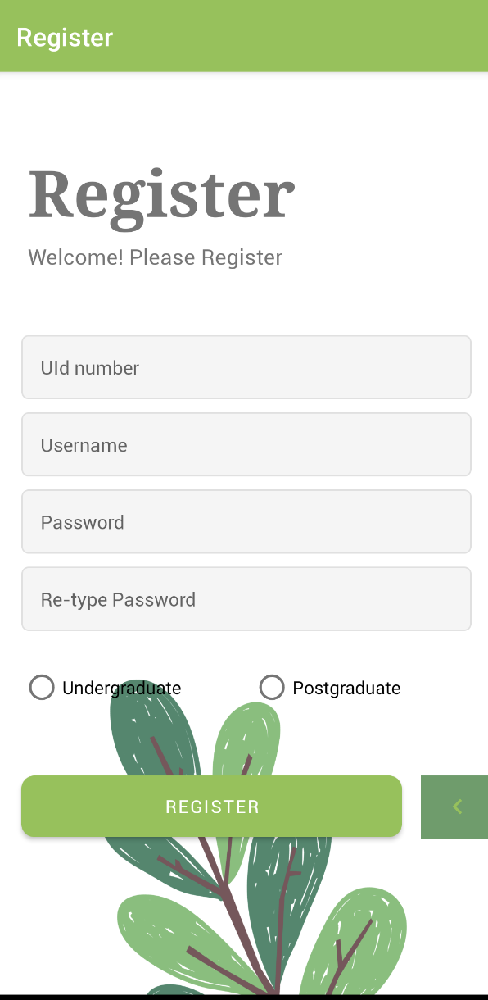

   **Home**  
This is the main hub of the app, where the user can choose to go to either the search activity, the timer activity, assessment activity,
or the leaderboard activity. After a user adds sources, they will be displayed on this page, and after they have studied a course,
their total study time will be displayed. The user can also choose to logout at the top right of this page.
 
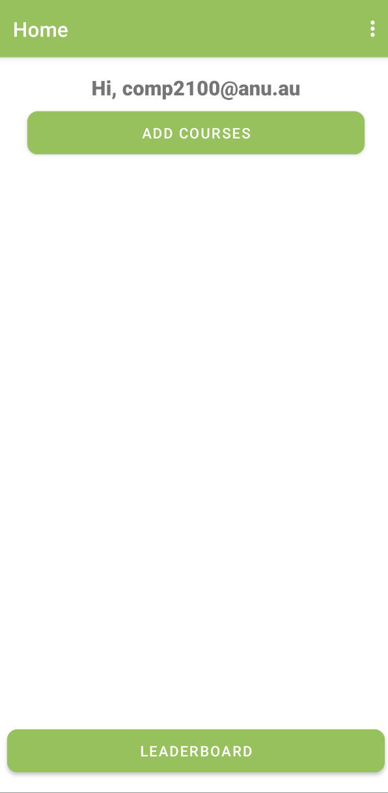
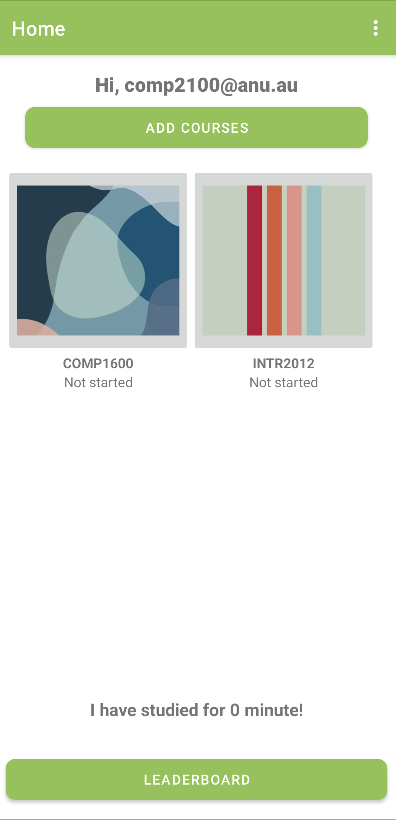
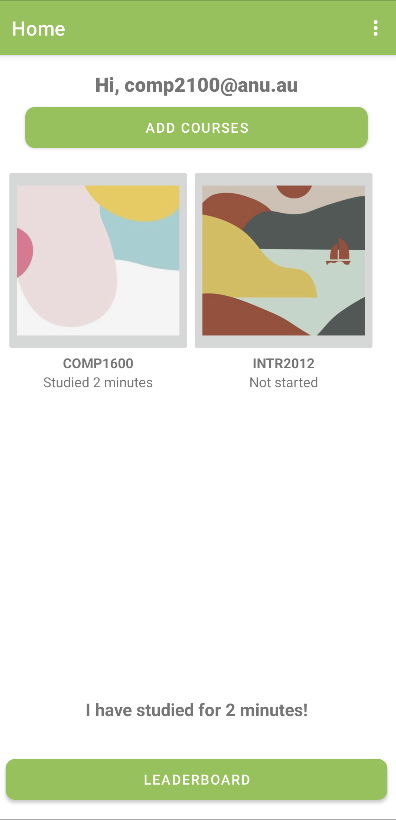

   **Search**  
Upon clicking the search button on the home page, the user will be taken to the search activity.
This is where the user can search for courses to add to their list of courses.
The results list will initially contain all undergraduate courses or all postgraduate courses
that are stored in post_courses_data.json or under_courses_data.json respectively,
depending on the users student type. The user can search by the grammars we have defined below, and
can be any combination of course, code, course name, or convener. The user can also filter the results
by 'availiable' and 'unavailable'. Once a user has chosen their courses the can click the 'add courses' button
and they will be taken back to the home page. The courses that they have added will now be displayed on the home page.
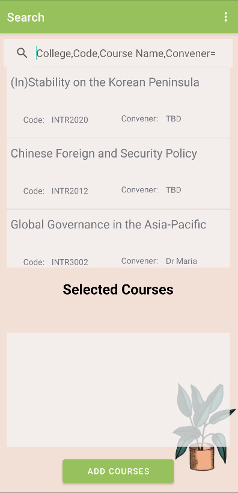
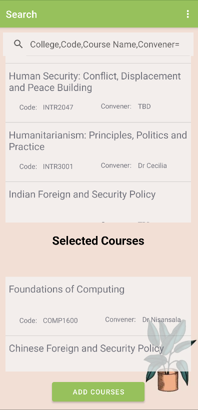

   **Assessment View**  
On the homepage, the user can click on a course to be taken to the assessment view. Here, the user can
 see the name of the course that they have added, as well as its conveners, and assessments.
From here, the user may start studying by clicking the 'Start Study' button, which will take them to
the timer interface, or my click the 'reset time' button to reset the time that they have studied for this course.
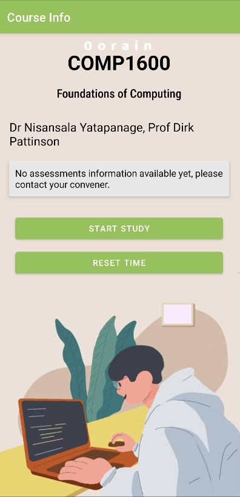

   **Timer Interface**  
Here the user can set a timer for the amount of time in minutes that they would like to study for. The time will then
countdown and a popup will display once the study session is completed. The user can pause and resume the timer,
or cancel the study session if desired.
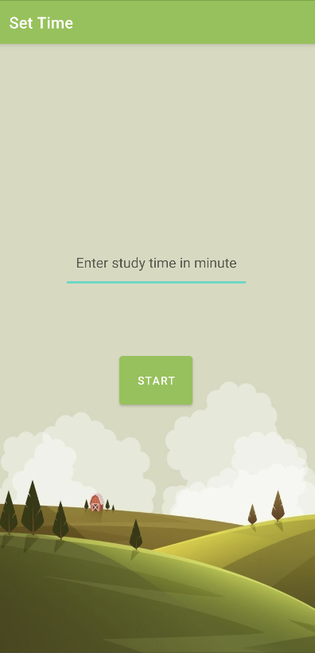
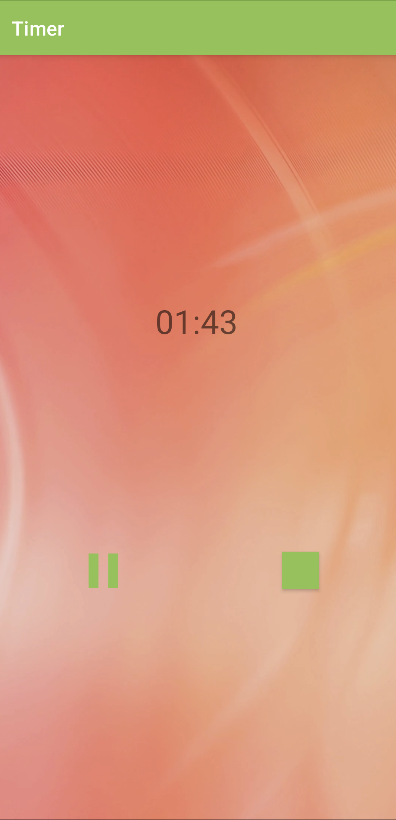
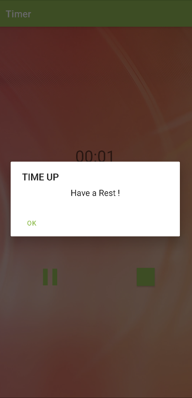
  

## Application UML
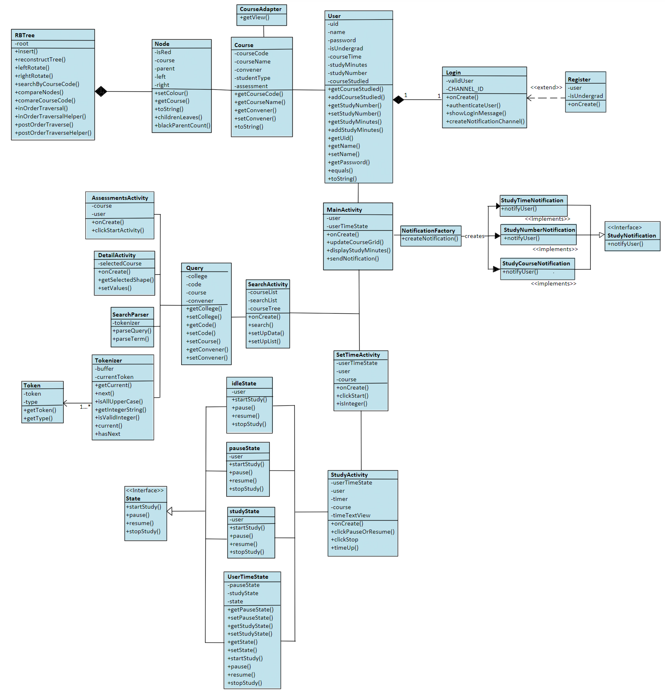  

## Application Design and Decisions

**Data Structures**

1. *RedBlack Tree*

   * *Objective:* It is used for storing Courses with the course code as a key which can then be found using the Search feature.

   * *Locations:* RBTree.java, SearchActivity.java

   * *Reasons:*

     * This tree is self-balancing, meaning that our data will be organised and structured even after multiple insertions

     * Has an O(log n) time intricacy for searching

     * We don't need to access the item by index for this feature

2. *Map*

   * *Objective:* A map is used to link the course and the amount of time studied.

   * *Locations:* User.java

   * *Reasons:*

     * Allows for quick data retrieval

     * Flexible key pairing which directly links two attributes to each other

     * The nature of this data structure mean there will be no duplicate keys

     * Maps are scalable and can handle large amounts of data

3. *Set*

   * *Objective:* A set is used to store a list of courses that a user is enrolled in

   * *Locations:* User.java

   * *Reasons:*

     * Eliminates duplicate elements

     * Searching operation takes O(logN) time complexity

     * Is dynamic and will not overflow, compared to other similar structures such as an array.

**Design Patterns**

1. *State Design Pattern*

   * *Objective:* This design pattern uses the startStudy, pause, resume, and stopStudy states to keep track of the current state of the timer implemented in the myTimer class.

   * *Locations:* State.java, StudyActivity.java, idleState.java, pauseState.java, studyState.java, UserTimeState.java

   * *Reasons:*

     * This will affect the functionality of the pause, resume and stop buttons according to the current state

     * The design is flexible enough to add or remove states if needed

2. *Factory Design Pattern*

   * *Objective:* The Factory design pattern provides an interface for creating new notification objects in a superclass, and allows for these superclasses to alter the type of object that will be created. This will allow us to notify users after certain actions have been completed.

   * *Locations:* StudyCourseNotification.java, StudyNotification.java, StudyNumberNotification.java, StudyTimeNotification.java, NotificationFactory.java

   * *Reasons:*

     * Factory design pattern is flexible and extendable and allows us to add and remove classes without making major changes to the app.

     * The design is flexible enough to add or remove new notifications or observers if needed.

     * Uses loose coupling and eliminates hard binding.

3. *Singleton Design Pattern*

   * *Objective:* The singleton design pattern is used in the MyTimer class to ...

   * *Locations:* MyTimer.java

   * *Reasons:*

     * The singleton class provides a global access point to get the instance of the class and prevents other objects from instantiating their own copies of the Singleton object, ensuring that all objects access the single instance.*
     
     * Saves space in memory as only one timer object is ever being created*
     
     * Lazy initialisation ensure the object is only created and initialised when it is needed

**Grammar(s)**

Production Rules:

        <exp>           ::= <course name> | <code> | <college> | <college> "," <term>
        <term>          ::= <factor> | <factor> "," <factor> | <factor> "," <factor> "," <factor>
        <factor>        ::= <code> | <course name> | <convener>
        <code>          ::= four-digit Integer | <college code>
        <college code>  ::=  <college> + four-digit Integer 
        <course name>   ::= String | "(" <course name> ")"
        <convener>      ::= "convener=" String
        <college>       ::= "COMP" | "MATH" | "PHYS" | "STATS" | ...

Example Queries:

* "COMP, 1110, Structured Programming, convener= Patrik Haslum" (complete search)
* "COMP1110 (search by code)
* "COMP" (filter by college)
* "COMP, 1110" (search by college and code)
* "Structured Programming" (search by course name)
* "COMP, Structured Programming" (search by college and course name)
* "(Structured Programing)" (dynamic course name search, retains filters)
* "COMP, (Structured Programing)" (dynamic course name search with college filter)

The grammar classifies the convener, name and code of the course as factors, and allows these to be
separated by commas. The college a course belongs to is classified as an exp, and can optionally be
appended by a series of factors separated by commas. This grammar design is flexible as it allows for
the user to search simply by the course name, college, or with more detail by adding the code,
and/or convener in any order. The only caveat to the flexible search method is that convener
searches must be appended after college as it searches based on the specific course tree.
Our grammar contains code, name, convener, and college as these are the most relevant keywords associated with a course.

**Tokenizer and Parsers**

We utilise tokenizers and parsers in our Search implementation. Once a user searches a term, this
String is tokenized into `COLLEGE`, `CODE`, `COLLEGECODE` `COURSE`, and `CONVENER` tokens. These
tokens are then parsed to determine if they follow the structure of the grammar that we have defined
for our app. If the search terms match the grammar, these tokens will be converted to
Strings and passed into a  Query object. This object can then be referenced to get all relevant
information required to complete the search process.
By using tokenizer and parsers, we are able to ensure that the search terms are valid, and that the
search process is completed correctly. This standardizes the search process, and ensures that
the user is able to search for courses in a consistent but also flexible manner.

**Surprise Item**

Our team did not attempt the surprise feature.

**Other**

*[TODO What other design decisions have you made which you feel are relevant? Feel free to separate these into their own subheadings.]*

## Summary of Known Errors and Bugs

1. *Bug 1:* 

   * *Description:* 

   * *Location:* 

   * *Steps to reproduce:*

   * *Expected result:*

   * *Actual result:*

   * *Cause of problem:*

   * *Solutions:*

- Once the user starts the timer the background is green for a while, while the background gif is loading.
- There can be a slight delay when transitioning from the login activity to the main activity, and from the main activity to the search activity
- The add courses button is not constrained properly and does not show properly on some phones. We tested our app on the Pixel 6.
- If you clear a courses time in assessments activity, the users total time remains the same. This is not necessarily a bug, depending on if the user wishes to retain his total time or change it. However, we did not account for those two option.

*List all the known errors and bugs here. If we find bugs/errors that your team does not know of, it shows that your testing is not thorough.*

## Testing Summary

*[What features have you tested? What is your testing coverage?]*

**RBTreeTest**

- *Number of test cases:* 6

- *Code coverage:*

- *Types of tests created:* JUnit tests
    * testEmptyTree
    * testSimpleInsertWithoutReconstruction
    * testDuplicateInsert
    * testMediumInsert
    * testComplexInsert
    * testSearchNonExist
    * testSearchByCourseCode

**NotificationFactoryTest**

- *Number of test cases:* 1

- *Code coverage:* 100% - Branch complete

- *Types of tests created:* JUnit tests
    * notificationFactoryTest

**SearchParserTest**

- *Number of test cases:* 4

- *Code coverage:* 90% - Branch complete

- *Types of tests created:* JUnit tests
    * testQueryCode
    * testQueryCourse
    * testQueryConvener
    * testIllegalArgumentException

**TokenizerTest**

- *Number of test cases:* 7

- *Code coverage:* 90% - Branch complete

- *Types of tests created:* JUnit tests
    * testTokenizeCode
    * testTokenizeCollege
    * testTokenizeCollegeCode
    * testTokenizeCourse
    * testTokenizeConvener
    * testTokenizeMixed
    * testNullToken

*Please provide some screenshots of your testing summary, showing the achieved testing coverage. Feel free to provide further details on your tests.*
ADD DIAGRAMS OUTLINE BRANCH COMPLETE ECT...

## Implemented Features

### Basic App
1. [Login]. Users must be able to log in (easy)
    * Class: Login.java, Register.java
    * Users are able to register, which will add them as a user to Firebase. Users that are contained in Firebase will be able to log in using their username and password, which will be validated by the app before authenticating the user. 
       
2. [Data Instances]. There must be 2500 data instances on Firebase (easy)
    * Class: user_data.JSON, Login.java OnCreate()
    * User information will be uploaded to Firebase once the app has launched by reading a local JSON file contain.
       
3. [Firebase Data Visualization]. The user must be able to load data/information from Firebase and visualise it (medium)
    * Class: xx.java, methods Z, Y, Lines of code: xx
    * A list of courses that a user is enrolled in, a list of friends, and a leaderboard ranking can be displayed using the user information stored on Firebase. 
    * not fully implemented 
       
4. [Search]. Users must be able to search for information on the app. (medium)
    * Classes: SearchActivity.java, SearchParser.java, Tokenizer.java, Token.java, RBTree.java
    * A user is able to search for a course by using keywords related to the subject, code, course, and/or convener.
       
 

### General Features
Feature Category: User Activity  
1. [Interact Follow]. The ability to ‘follow’ a course or any specific items. There must be a section specifically dedicated to 'things' followed. (medium)
   * Classes: activity_assessments.xml, activity_main.xml, AssessmentsActivity.java 
   * A user can search for a course and follow it, to add this course to their main screen.
       
2. [Interact-Noti]. The ability to send notifications based on different types of interactions. A notification must be sent only after a predetermined number of interactions are set. (medium)
   * Classes: NotificationFactory.java, StudyNotification.java, StudyCourseNotification.java, StudyNumberNotification.java, StudyTimeNotification.java
   * A user will be notified if they have studied more than two courses, completed two or more study sessions, or if they have studied for longer than an hour. 
  

Feature Category: Firebase Integration  
3. [FB-Persist] Use Firebase to persist all data used in your app. (medium)
   * Class A: methods A, B, C, lines of code: whole file
       
4. [FB-Syn] Using Firebase or another remote database to store user information and having the app
updated as the remote database is updated without restarting the application. (hard)
   * Class A: methods A, B, C, lines of code: whole file
        

Feature Category: Greater Data Usage, Handling and Sophistication  
5. [Data-Graphical] Graphical report viewer. Provide users with the ability to see a report of interactions with your app in a graphical manner. (medium)
   * Class A: methods A, B, C, lines of code: whole file
   * Users can view a leaderboard of the top 5 users of the app, and their ranking. It also displays the users own study minutes.
        

Feature Category: Search-related Features  
6. [Search-Invalid] Search functionality can handle partially valid and invalid search queries. (medium)
   * SearchActivity.java, SearchParser.java, Tokenizer.java, Token.java
   * If a search produces an error in the search method, or while being converted into a token or query, the search will result in nothing.
      
7. [Search-Filter] Sort and/or filter a list of items returned from a search, with the help of suitable UI components. For instance, when searching for assignments, include checkboxes for users to select
   the target course(s); include drop-down field for the selection of sorting methods, etc. (easy)
    * SearchActivity.java
    * The user may use an options menu to filter the course into those that are available an unavailable, which is determined by whether the course has a convener or not. 
        

## Team Meetings

- *[Team Meeting 1](./meeting1.md)*
- *[Team Meeting 2](./meeting2.md)*
- *[Team Meeting 3](./meeting3.md)*
- *[Team Meeting 4](./meeting4.md)*
 

