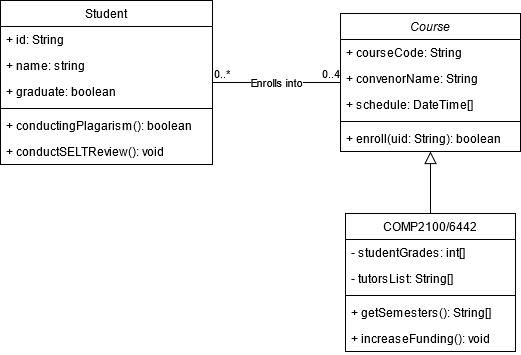

# [G48] Report

The following is a report template to help your team successfully provide all the details necessary for your report in a structured and organised manner. Please give a straightforward and concise report that best demonstrates your project. Note that a good report will give a better impression of your project to the reviewers.

*Here are some tips to write a good report:*

* *Try to summarise and list the `bullet points` of your project as many as possible rather than give long, tedious paragraphs that mix up everything together.*

* *Try to create `diagrams` instead of text descriptions, which are more straightforward and explanatory.*

* *Try to make your report `well structured`, which is easier for the reviewers to capture the necessary information.*

*We give instructions enclosed in square brackets [...] and examples for each sections to demonstrate what are expected for your project report.*

*Please remove the instructions or examples in `italic` in your final report.*

## Table of Contents

1. [Team Members and Roles](#team-members-and-roles)
2. [Summary of Individual Contributions](#summary-of-individual-contributions)
3. [Conflict Resolution Protocol](#conflict-resolution-protocol)
4. [Application Description](#application-description)
5. [Application UML](#application-uml)
6. [Application Design and Decisions](#application-design-and-decisions)
7. [Summary of Known Errors and Bugs](#summary-of-known-errors-and-bugs)
8. [Testing Summary](#testing-summary)
9. [Implemented Features](#implemented-features)
10. [Team Meetings](#team-meetings)

## Team Members and Roles

| UID | Name | Role |
| :--- | :----: | ---: |
| [u7490701] | [Ahmed Qaisar] | [Firebase] |
| [u7103031] | [Lana Fraser] | [Login and Report] |
| [u7432723] | [Punit Deshwal] | [Database Structures and UI Themes] |
| [u7108792] | [Quoc Nguyen] | [Search, Tokeniser and Parser] |
| [u7533843] | [Yanghe Dong] | [Tree Structure and Timer] |

## Summary of Individual Contributions

*u7490701, Ahmed, I contribute 20% of the code. Here are my contributions:*
* A.Firebase
*Report Writing: N/A*
*Slide Preparation: N/A*

*u7103031, Lana, I contribute 20% of the code. Here are my contributions:*
* A.Login link: app/src/main/java/com/studybuddy/Login.java
* B.activity_login.xml link: app/src/main/res/layout/activity_login.xml
*UI Design: Proposed and designed the UI for the Login class*
*Report Writing: N/A*
*Slide Preparation: N/A*

*u7432723, Punit, I contribute 20% of the code. Here are my contributions:*
* A.MainActivity link:app/src/main/java/com/studybuddy/MainActivity.java
* B.activity_main.xml link:app/src/main/res/layout/activity_main.xml
* C.item_course.xml link:app/src/main/res/layout/item_course.xml
* D.AssessementsActivity link:app/src/main/java/com/studybuddy/AssessmentsActivity.java
* E.activity_assessements.xml link:app/src/main/res/layout/activity_assessments.xml
*UI Design: Proposed and designed the UI for the Main class. Created a new colour theme for the app. Developed many of the conceptual ideas for the desgins of each UI screen and how they interact togehter*
*Report Writing: N/A*
*Slide Preparation: N/A*

*u7108792, Quoc, I contribute 20% of the code. Here are my contributions:*
* A.SearchActivity link: src/studybuddy/app/src/main/java/com/studybuddy/SearchActivity.java
* B.activity_search.xml link: src/studybuddy/app/src/main/res/layout/activity_search.xml
* C.user_cell.xml link: app/src/main/res/layout/user_cell.xml
* D.SearchParser link:app/src/main/java/com/studybuddy/SearchParser.java
* E.SearchToken link:app/src/main/java/com/studybuddy/SearchToken.java
* F.Query link:app/src/main/java/com/studybuddy/Query.java
* G.Token link:app/src/main/java/com/studybuddy/Token.java
* H.Tokenizer link: app/src/main/java/com/studybuddy/Tokenizer.java
* I.TokenizerTest link:app/src/test/java/com/studybuddy/TokenizerTest.java
*UI Design: Proposed and designed the UI for the SearchActivity class*
*Report Writing: N/A*
*Slide Preparation: N/A*

*u7432723, Yanghe, I contribute 20% of the code. Here are my contributions:*
* A.Course link:app/src/main/java/com/studybuddy/Course.java
* B.RBTree link:app/src/main/java/com/studybuddy/RBTree.java
* C.User link:app/src/main/java/com/studybuddy/User.java
* D.RBTreeTest link:app/src/test/java/com/studybuddy/RBTreeTest.java
* E.SetTimeActivity link:app/src/main/java/com/studybuddy/SetTimeActivity.java
* F.StudyActivity link:app/src/main/java/com/studybuddy/StudyActivity.java
* F.IdleState link:app/src/main/java/com/studybuddy/idleState.java
* F.MyTimer link:app/src/main/java/com/studybuddy/myTimer.java
* G.PauseState link:app/src/main/java/com/studybuddy/pauseState.java
* H.StudyState link:app/src/main/java/com/studybuddy/studyState.java
* I.activity_set_time.xml link:app/src/main/res/layout/activity_set_time.xml
* J.activity_study.xml link:app/src/main/res/layout/activity_study.xml
*Code Design: Proposed and implemented a tree stucture for storing our data. Proposed and implemented a state design pattern for the timer functionality.*
*UI Design: Proposed and designed the UI for the MyTimer class.*
*Report Writing: N/A*
*Slide Preparation: N/A*

## Conflict Resolution Protocol

*Disputes in contributions will be resolved by a team meeting and voting. (needs to be refined)*

## Application Description

*StudyBuddy is a productivity and educational app that allows its users to keep track of the time that they have spent studying for each subject that they are enrolled in. This app allows the user to add friends and compare study times with your friends. This app includes a login interface, the ability to search for and enroll in courses, a timer functionality, and a graphics summary tab. *

**Application Use Cases and or Examples**

*Targets Users: Students*

* *Users can search and enroll in courses. The app will provide a breif overview of the course and its assessements.*
* *Once enrolled users can select one of their courses and set a timer for the time they would like to study*
* *Users can add another user as a friend if they are enrolled in the same course. 
* *A user can view a summary of their total time studied.*

* I will add a use case diagram https://www.visual-paradigm.com/guide/uml-unified-modeling-language/what-is-use-case-diagram/ *

## Application UML

  
*[Replace the above with a class diagram. You can look at how we have linked an image here as an example of how you can do it too.]*

## Application Design and Decisions

*Please give clear and concise descriptions for each subsections of this part. It would be better to list all the concrete items for each subsection and give no more than `5` concise, crucial reasons of your design. Here is an example for the subsection `Data Structures`:*

**Data Structures**

1. *RedBlack Tree*

   * *Objective: It is used for storing Courses and Users which can then be found using the Search feature.*

   * *Locations: lines 6-318 in RBTree.java*

   * *Reasons:*

     * *This tree is self balancing, meaning that our data will be organised and structured even after multiple insertions*
     
     * *Has an O(log n) time intricacy for searching*

     * *We don't need to access the item by index for this feature*

2. ...

3. ...

**Design Patterns**

1. *State Design Pattern*

   * *Objective: This design pattern uses the startStudy, pause, resume, and stopStudy states to keep track of the current state of the timer implented in the myTimer class.*

   * *Locations: State.java,*

   * *Reasons:*

     * *This will affect the functionlity of the pause, resume and stop buttons according to the current state*
     
     * *The design is flexible enough to add or remove states if needed*

2. ...

3. ...

**Grammar(s)**

Production Rules:
    
    college: COMP, code: 1110, name: Structured Programming, convener: Patrik Haslum"

        <exp>       ::= "college:" <college> | "college:" <college> "," <term>
        <term>      ::= <factor> | <factor> "," <factor> | <factor> "," <factor> "," <factor>
        <factor>    ::= <code> | <name> | <convener>
        <code>      ::= "code:" four-digit Integer
        <name>      ::= "name:" String
        <convener>  ::= "convener:" String
        <college>   ::= "COMP" | "MATH" | "PHYS" | "STATS" | ...

*[How do you design the grammar? What are the advantages of your designs?]*

*If there are several grammars, list them all under this section and what they relate to.*

**Tokenizer and Parsers**

*[Where do you use tokenisers and parsers? How are they built? What are the advantages of the designs?]*

**Surprise Item**

*[If you implement the surprise item, explain how your solution addresses the surprise task. What decisions do your team make in addressing the problem?]*

**Other**

*[What other design decisions have you made which you feel are relevant? Feel free to separate these into their own subheadings.]*

## Summary of Known Errors and Bugs

1. *Bug 1:*

- ...

*List all the known errors and bugs here. If we find bugs/errors that your team does not know of, it shows that your testing is not thorough.*

## Testing Summary

*[What features have you tested? What is your testing coverage?]*

*Here is an example:*

- *Number of test cases: ...*

- *Code coverage: ...*

- *Types of tests created: ...*

*Please provide some screenshots of your testing summary, showing the achieved testing coverage. Feel free to provide further details on your tests.*

## Implemented Features

### Basic App
1. [Login]. Allows the user to login (easy)
    * Class Login.java, methods Z, Y, Lines of code: whole file
    * So far only allows users on the login.csv file login.
       
2. [Data Instances]. There 2500 data instances on FIrebase (easy)
    * Class xx.java, methods Z, Y, Lines of code: xx
    * The user is able to click on and view each course and user.
       
3. [Firebase Data Visualization]. The user is able to visualise the data that is stored on firebase (medium)
    * Class xx.java, methods Z, Y, Lines of code: xx
    * The user is able to click on and view each course and user. 
    * not fully implemented 
       
4. [Search]. Users are able to search for information on the app. (medium)
    * Clases SearchActivity.java, SearchParser.java, SearchActivity.java, Tokenizer.java, Token.java, methods Z, Y, Lines of code: xx
    * The user is able to serch for a course by using keywords related to the  subject, code, course, and/or convener.
       
  

### General Features
Feature Category: User Activity  
1. [Interact Follow]. Interact-Follow] The ability to ‘follow’ a course or any specific items. There must be a section specifically dedicated to 'things' followed (e.g., showing all updates from all courses followed in chronological order). (medium)
   * Class A: methods A, B, C, lines of code: whole file
   * A user can search for a course and follow it, to add this course to their main screen 
   * … unimplimeted
2. [Interact-Noti]. TThe ability to send notifications based on different types of interactions (e.g., new announcement, assignment submissions, etc). A notification must be sent only after a predetermined number of interactions are set (>= 2 interactions [e.g., 2 announcements have been
made or 2 follow requests have been received). Note: it is not mandatory to use the Android
Notification classes. (medium)
   * Class A: methods A, B, C, lines of code: whole file
   * A user will be notified if their friend is studying 
   * … unimplimeted
 

Feature Category: Firebase Integration  
3. [FB-Persist] Use Firebase to persist all data used in your app. (medium)
   * Class A: methods A, B, C, lines of code: whole file
   * … unimplimeted
4. [FB-Syn] Using Firebase or another remote database to store user information and having the app
updated as the remote database is updated without restarting the application. e.g. User A (a lecturer) posts an announcement, user B on a separate instance of the application sees the
announcement appear on their app instance without restarting their application. (hard)
   * Class A: methods A, B, C, lines of code: whole file
   * … unimplimeted

Feature Category: Greater Data Usage, Handling and Sophistication  
5. [Data-Graphical] Graphical report viewer. Provide users with the ability to see a report of interactions with your app (e.g., summary of assessment results for a course or an individual student, etc), in a graphical manner. (medium)
    * Class A: methods A, B, C, lines of code: whole file
   * … unimplimeted

*List all features you have completed in their separate categories with their difficulty classification. If they are features that are suggested and approved, please state this somewhere as well.*

## Team Meetings

*Here is an example (you could start numbering your meetings from 1):*

- *[Team Meeting 1](./meeting1.md)*
- *[Team Meeting 2](./meeting2.md)*
- *[Team Meeting 3](./meeting3.md)*

* Link to the minutes of your meetings as above. There must be at least 4 team meetings.*
 

